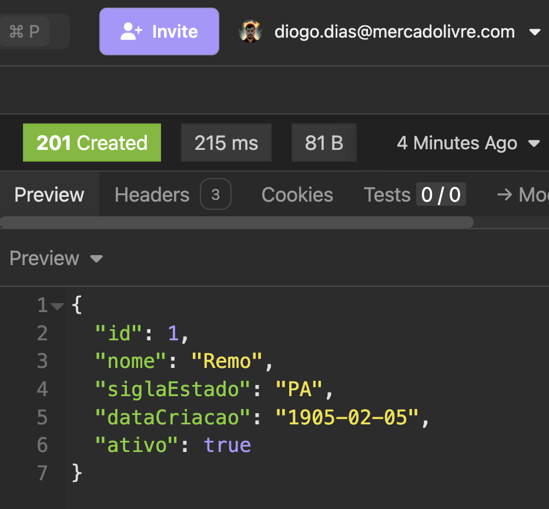
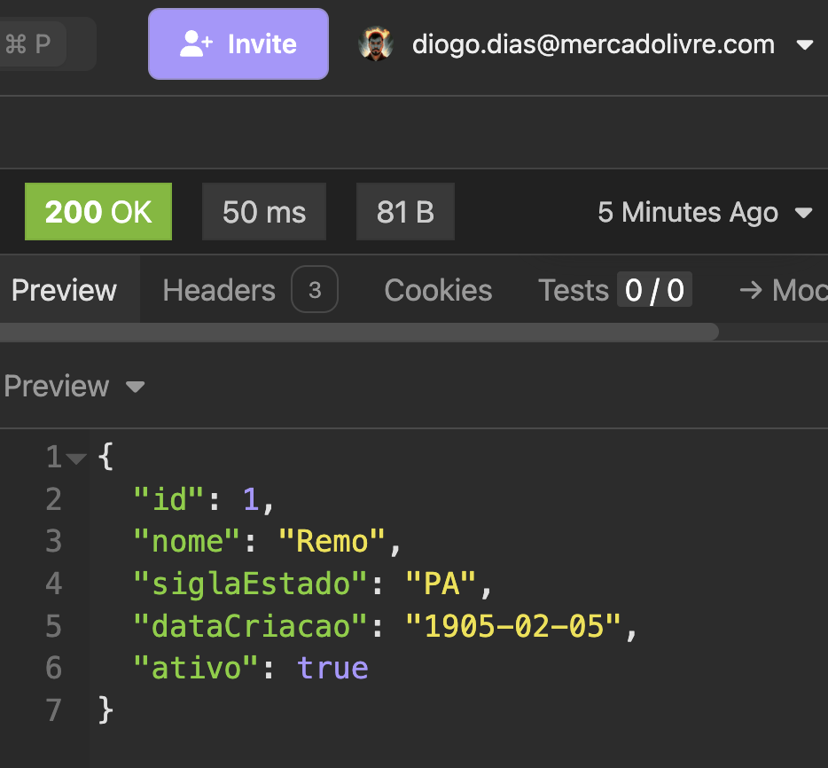
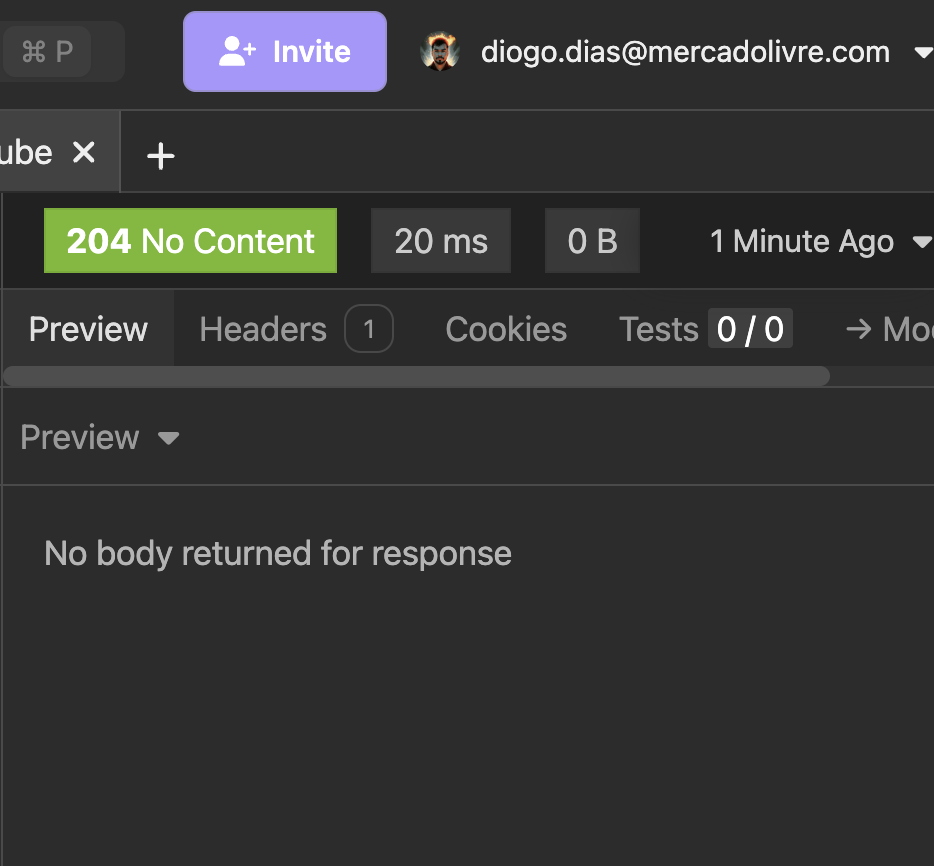
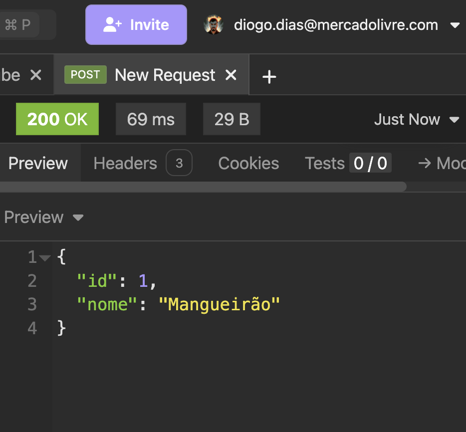
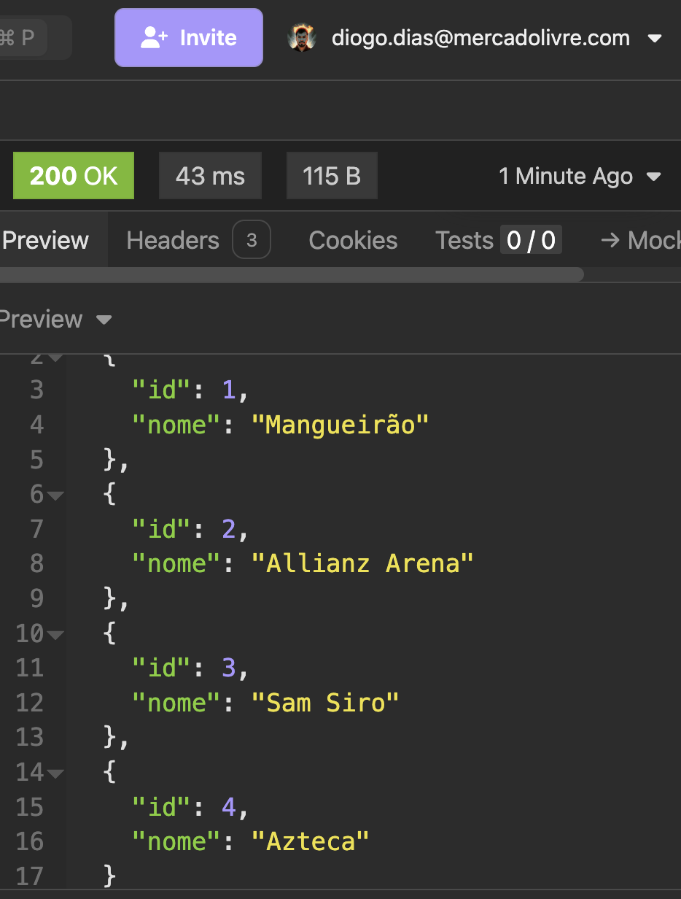

# Projeto Final - API de Partidas de Futebol

Este é um projeto do Neocamp -TeamCubation em Java com Spring Boot,
com o objetivo de praticar os fundamentos de API REST, 
entidades relacionais, regras de negócio e testes unitários. 
Ele simula o cadastro e gerenciamento de clubes, estádios e partidas.

[](https://GitHub.com/Naereen/StrapDown.js/graphs/commit-activity) 
[](https://github.com/Naereen/StrapDown.js/blob/master/LICENSE)
[](https://GitHub.com/Naereen/StrapDown.js/commit/)
---

## 🛠️ Tecnologias Utilizadas

- Java 21+
- Spring Boot 
- Spring Data JPA
- MySQL (via Docker)
- Maven
- JUnit 5 + Mockito

---

## 📦 Funcionalidades

- ✅ Cadastro e busca de **clubes** (com validações)
- ✅ Cadastro e listagem de **estádios**
- ✅ Cadastro, edição e remoção de **partidas**
---

## ▶️ Como Rodar o Projeto

### 🐋 Subir o MySQL com Docker

```bash
docker-compose up -d
```
---

### 🚀 Rodar a aplicação

```bash
./mvnw spring-boot:run
```

Ou rode direto pela IDE clicando em `Run`.

---

## 🔍 Exemplos de Endpoints

---

### 📁 CLUBE

#### ✅ Criar Clube (POST `/clubes`)
```json
POST /clubes
Content-Type: application/json

{
  "nome": "Remo",
  "siglaEstado": "PA",
  "dataCriacao": "1905-02-05",
  "ativo": true
}
```



#### 🔍 Buscar por ID (GET `/clubes/{id}`)
```http
GET /clubes/1
```


#### ❌ Desativar clube (DELETE lógico)
```http
DELETE /clubes/1
```


---

### 🏟️ ESTÁDIO

#### ✅ Criar Estádio (POST `/estadios`)
```json
POST /estadios
Content-Type: application/json

{
  "nome": "Mangueirão",
  "cidade": "Belém",
  "capacidade": 53635
}
```


#### 🔍 Buscar todos
```http
GET /estadios
```


---

### ⚽ PARTIDA

#### ✅ Criar Partida (POST `/partidas`)
```json
POST /partidas
Content-Type: application/json

{
  "mandante": { "id": 1 },
  "visitante": { "id": 2 },
  "estadio": { "id": 1 },
  "dataHora": "2025-08-01T16:00:00"
}
```

#### ✏️ Atualizar Partida (PUT `/partidas/{id}`)
```json
PUT /partidas/1
Content-Type: application/json

{
  "mandante": { "id": 2 },
  "visitante": { "id": 1 },
  "estadio": { "id": 1 },
  "dataHora": "2025-08-02T18:00:00"
}
```

#### ❌ Remover partida
```http
DELETE /partidas/1
```

---


## 🤝 Autor

Projeto criado por **Diogo Pereira Dias**

[](https://www.linkedin.com/in/diogo-dias-07168a156/)
 em cooperação com a equipe do Neocamp - TeamCubation.